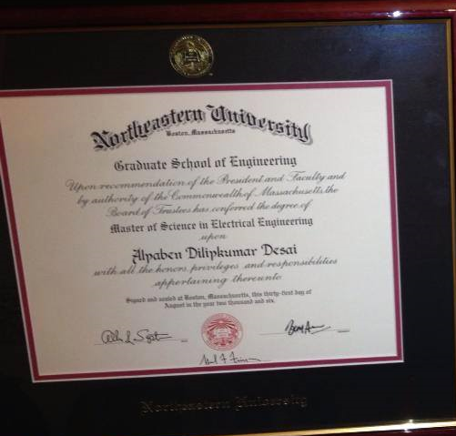

# MSECE_Architectural Design

Architectural design includes evaluating the technical feasibility  of the business requirements. 

Advanced knowledge reference : https://github.com/alpaddesai/FirmwareDesign , https://github.com/alpaddesai/AnalogDesign , https://github.com/alpaddesai/ComputerArchitecture , https://github.com/alpaddesai/RFMicroelectronics , https://github.com/alpaddesai/EmbeddedDesign, https://github.com/alpaddesai/PCBSignalIntegrity_EEM , https://github.com/alpaddesai/WirelessNetworkingProducts , https://github.com/alpaddesai/Hardware_Firmware_Security and https://github.com/alpaddesai/SoC_HPC

Additional details: https://github.com/alpaddesai/MSEE_SmartGridDesignIdea

## Master of Science in Electrical Engineering

